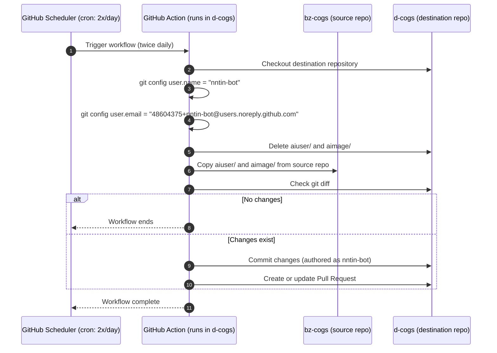

In d-flows/actions/sync-cogs/action.yml the source repo can be configured with source_repo. Here it is @bz-cogs.  
In d-flows/actions/sync-cogs/action.yml cog_names can be configured. Here it is aiuser and aiimage, see qbz-cogs/aiuser and @bz-cogs/aimage