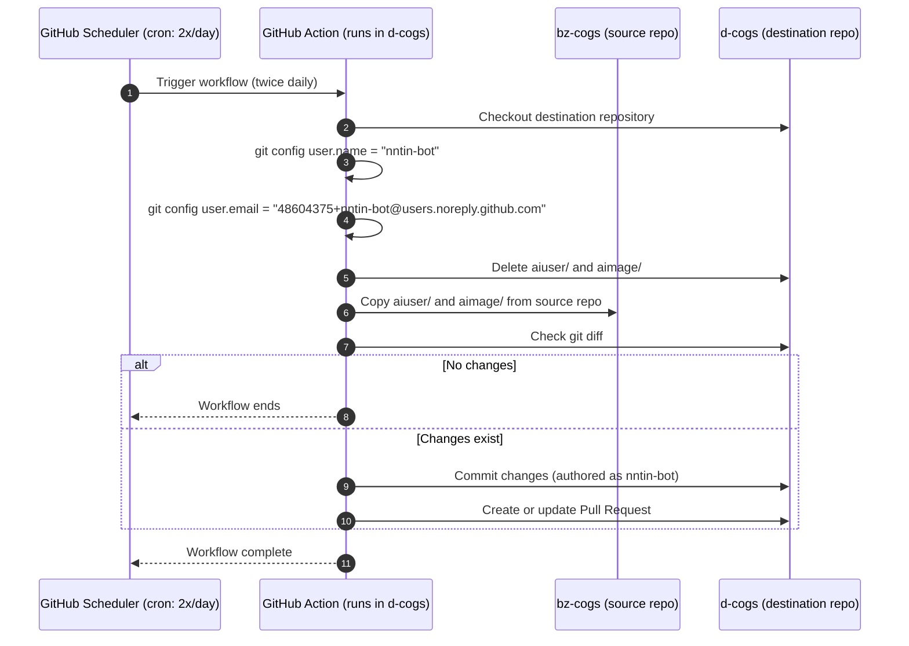

Use `d-flows/actions/sync-cogs/action.yml` to keep specific cogs in sync between repositories. Configure `source_repo` for the source (e.g. `nntin/bz-cogs`) and `cog_names` for the directories to mirror.

## Usage (twice daily)

```yaml
name: Sync cogs
on:
  schedule:
    - cron: "0 0,12 * * *" # Twice daily
  workflow_dispatch:

jobs:
  sync:
    runs-on: ubuntu-latest
    permissions:
      contents: write
      pull-requests: write
    steps:
      - name: Sync aiuser & aimage
        uses: nntin/d-flows/actions/sync-cogs@main
        with:
          token: ${{ secrets.GITHUB_TOKEN }}
          source_repo: https://github.com/nntin/bz-cogs.git # owner/repo also works
          source_branch: main
          destination_repo: nntin/d-cogs
          destination_branch: main
          cog_names: aiuser,aimage
          pr_branch: automation/sync-cogs
          pr_title: "chore: sync aiuser & aimage"
```

`peter-evans/create-pull-request@v7` is used to open or update the PR with the synced directories, authored as `nntin-bot`. The commit message is always `chore: sync cogs from <source_repo_url> @ <source_sha>`.
`source_repo` accepts both `owner/repo` slugs and full HTTPS git URLs (e.g., `https://c.csw.im/cswimr/SeaCogs.git`).
