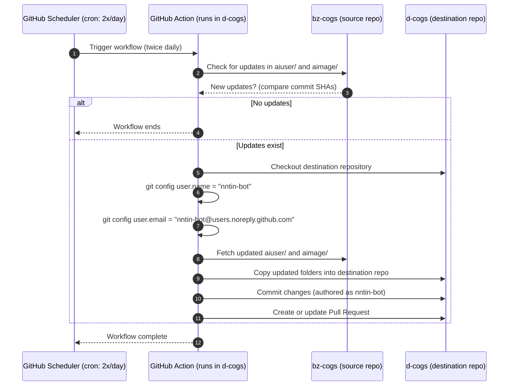

AI revision work:
- [ ] Implement cog syncing and commit logic in sync-cogs action
- [ ] Implement PR creation with single/multiple PR support in sync-cogs action
- [ ] Implement workflow using the new GitHub Action in d-cogs (💀gonna be a nightmare testing without nektos/act)

Bugs:
- [ ] commit user configured as [nntin-bot](https://github.com/nntin-bot), would be better if this is customizable
- [ ] c.csw.im is hardcoded, should not be
- [ ] fork is always created, not possible for git repositories not living on GitHub
  - [ ] relevant for destination repository, don't maintain a forgejo or gitea instance to test myself
- [ ] TOKEN assumes a third party unrelated account (e.g. a github bot account)
  - [ ] we should (??) support the owner account of the destination repository, but this opens a security risk, that's why the PoC was started with a third party github bot account

To provide proper forgejo/gitea compatibility is not high on my todo list since I don't use it and it will require quite a bit of changes

Create a final sequence diagram to verify behavior!

